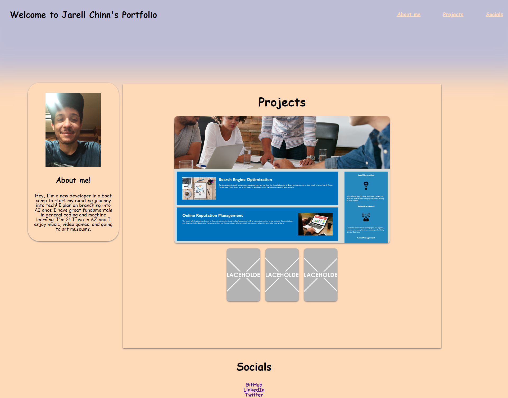

# Jarell Chinn Portfolio

## Technology Used

| Technology Used |                                              Resource URL                                              |
| --------------- | :----------------------------------------------------------------------------------------------------: |
| HTML            | [https://developer.mozilla.org/en-US/docs/Web/HTML](https://developer.mozilla.org/en-US/docs/Web/HTML) |
| CSS             |  [https://developer.mozilla.org/en-US/docs/Web/CSS](https://developer.mozilla.org/en-US/docs/Web/CSS)  |
| Git             |                              [https://git-scm.com/](https://git-scm.com/)                              |

## Description

[Visit the Deployed Site](https://jarell-chinn.github.io/Portfolio/#socials)

This is my portfolio to showcase my growing skills as web developer. This has a little bit about me and what my goals are for the future and some work that I have completed. Near the bottom you'll see my socials.

## Usage

# Learning points/Features

The biggest problem I had while making this website was the layout. It took me way too long to figure out how to display the projects under the projects header and to the right of the about me. Then I had a solution of making the projects part of the project header just organizing it within the parent. I look forward to updating this project to add more features and style to it. I very proud of my box-shadow usage on the header to make the entire page a pseudo gradient type page.

## Aurthor Info

- [LinkedIn](https://www.linkedin.com/in/jarell-chinn-517307220/)
- [Github](https://github.com/Jarell-Chinn)
